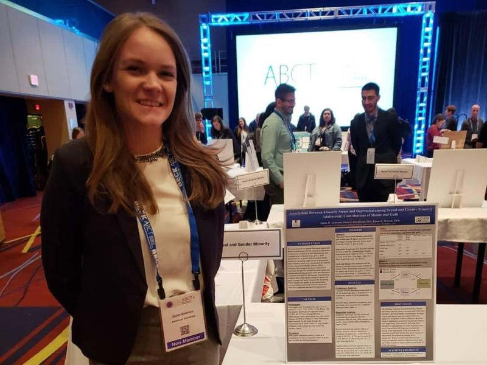
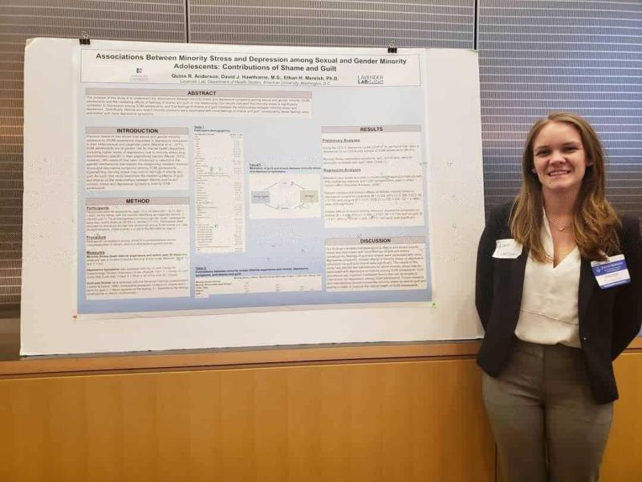

## Research Experience

### *Lavender Lab*

I am currently a student in the MSc in Epidemiology program at Columbia Mailman School of Public Health. My previous research experience from the Lavender Lab at American University was related to studying sexual adolescent minority (SMA) behavioral health outcomes related to familial support. In 2018, I presented our findings at two conferences in Washington DC: the 52nd Association for Behavioral and Cognitive Therapies Convention and the Maryland Public Health Association Conference. 

, 

Our published findings of which I am a co-author can be found [here](https://onlinelibrary.wiley.com/doi/10.1111/fare.12514).

### *Yale CORE*

At the Yale Center for Outcomes Research and Evaluation (CORE), I worked on five projects throughout my two years that were priorities of the Centers for Medicare and Medicaid. Most recently, I coordinated health outcomes research for total hip and knee arthroplasty patient-reported outcome measures (THA/TKA PRO-PMs) at the Yale Center for Outcomes Research and Evaluation. This resulted in a national roll out of a national THA/TKA PRO-PM measure directed to improve Medicare beneficiary patient outcomes.

## Research Interests

In the future, I am interested in combining my research experiences in health outcomes research and adolescent behavioral health research to investigate psychiatric epidemiology and behavioral health outcomes among patients with chronic illnesses. My other research interests include chronic disease epidemiology, psychiatric epidemiology, and long-term health outcomes for older adults. 

## Resume

<object data="images/Quinn Anderson Resume.pdf" width="800" height="800" type='application/pdf'/>
