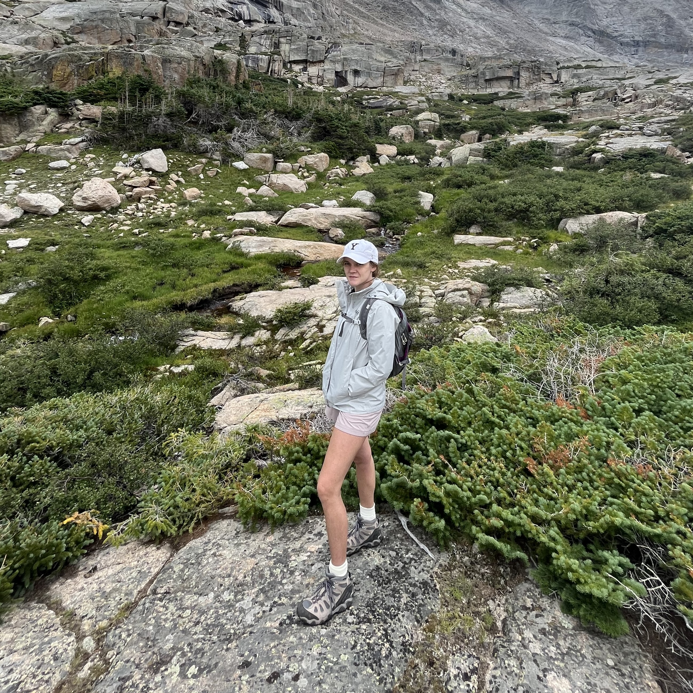
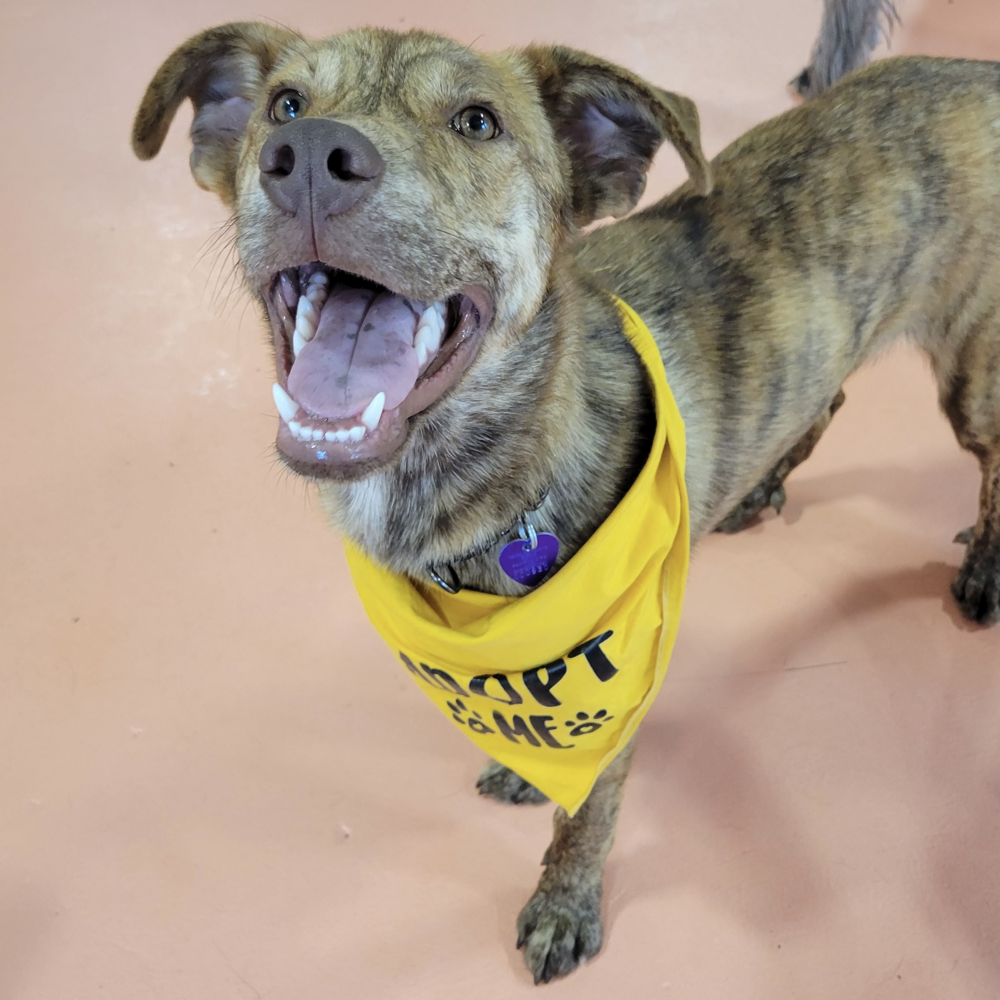
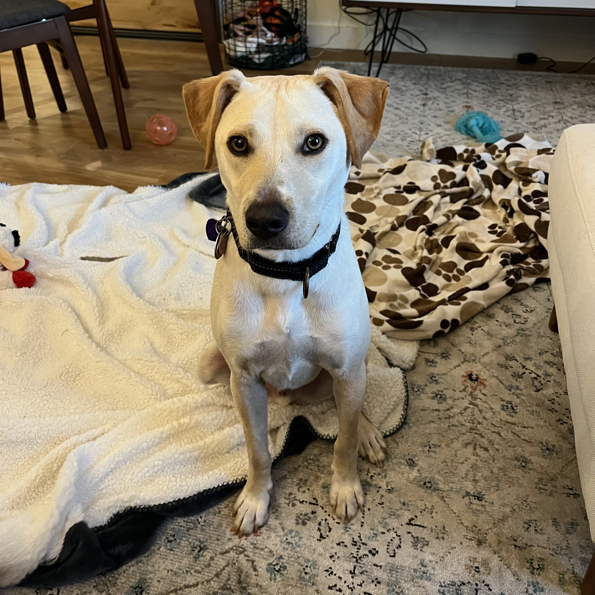

## Welcome!

I am an epidemiology student, public health researcher, advocate for the outdoors, foster dog mom, and lifelong learner.

, , 

,  

## Background

Originally from San Francisco, CA, my heart belongs to the East coast as I've resided here going on seven years. I completed my BS(c) in Public Health at American University in Washington D.C in May 2020. Shortly following graduation and in the pandemic, I worked at a public health startup in Denver, CO, and a government contractor for Centers for Medicare and Medicaid. The latter experience sparked my interest in health outcomes research on a population level. I began my MS(c) in Epidemiology journey based on this interest.

When I'm not working behind a computer or in a lab, I can typically be found on a long run or hike, learning to climb (indoors and outdoors!), or fostering dogs transported to the Northeast from the south to rescue them from high kill shelters. 

My professional work experience and resume can be found on this page [here](about.html).

